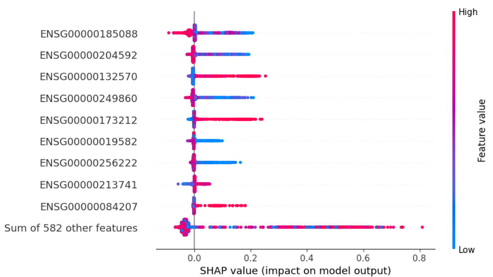
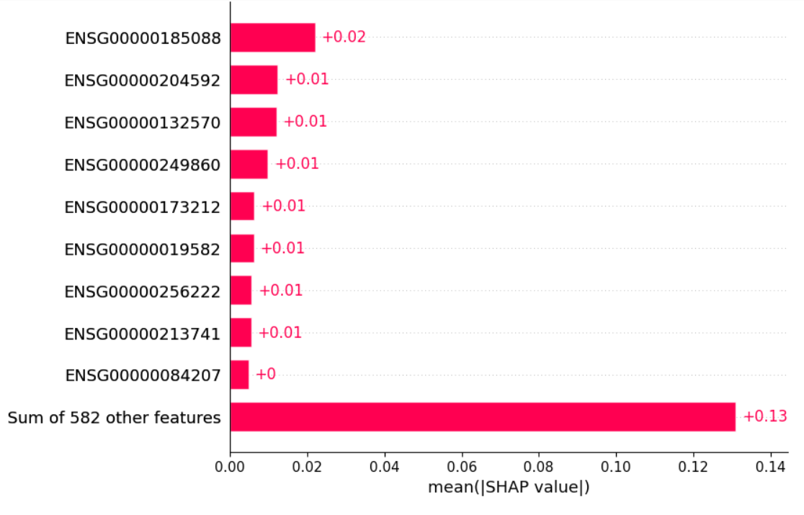

```{r setup, include=FALSE}
library(data.table)
library(ggplot2)
library(Rtsne)
library(biomaRt)
library(stringr)
library(scales)
library(pheatmap)

knitr::opts_chunk$set(echo = FALSE)
```

# Introduction

The intricate interplay between tumor cells and their microenvironment is a critical factor influencing cancer development and therapeutic outcomes, particularly evident in melanoma [1-5]. The tumor microenvironment (TME) constitutes a complex ecosystem with diverse cell types, encompassing malignant, immune, and stromal cells, as well as extracellular matrix components [1,2]. The challenges posed by this cellular diversity within the TME are underscored by the variable clinical efficacy of targeted therapies and immunotherapies in melanoma [3]. While immune checkpoint inhibitors exhibit responses in metastatic melanomas, the genomic and molecular determinants of these responses remain elusive [3,4]. Additionally, melanomas with the BRAFV600E mutation, commonly treated with RAF and MEK inhibitors, eventually develop resistance to these drugs [4]. The absence of targeted therapies for tumors lacking BRAF mutations emphasizes the need for a comprehensive understanding of melanoma composition and its impact on clinical outcomes [4]. Recent research papers highlight the next wave of therapeutic advances in cancer, centering on unraveling the intricacies of the melanoma TME and employing technologies like single-cell genomic approaches to assess cellular heterogeneity and inform treatment responses [3-5].

The integration of single-cell RNA-sequencing (scRNA-seq) with supervised learning approaches has emerged as a powerful tool for unraveling regulatory dynamics and predicting treatment resistance in skin cancers, like basal cell carcinoma (BCC) [6]. In Liu, et al 2021 [6], the integration of data analysis and machine learning is employed to discern the distinctive features of immune responses in BCC, PDAC, and melanoma. By utilizing supervised learning, the study not only identifies the molecular determinants associated with non-response to PD-1 blockade but also constructs a classifier that predicts response on a cellular level. Strikingly, the classifier achieves near-perfect accuracy in predicting response to PD-1 blockade in BCC CD8+ T cells. The incorporation of supervised learning methods facilitated the prediction of treatment resistance, revealing a distinctive resistance signature in melanoma that provides valuable insights into resistant sub populations and uncovers potential therapeutic options.

Recent advancements in machine learning interpretability tools, such as SHapley Additive exPlanations (SHAP), offer an alternative perspective for understanding supervised learning models [7]. SHAP estimates the contribution of a given variable to the observed prediction by approximating its marginal contribution under all possible combinations with other variables [7]. This aids in elucidating complex interactions within individual predictions, revealing the weight of each input variable in making predictions. The increasing use of SHAP analysis for biological datasets underscores its potential for providing insight into gene regulation dynamics [8,9]. In the current project, the SHAP framework was utilized to identify the genes most relevant in predicting tumor malignancy, offering a precise interpretation of the main contributors to model performance. This integrated approach enhances our understanding of melanoma pathogenesis, treatment resistance, and the potential for targeted therapeutic interventions.

# Research goal

The current project aims to determine the possibility of translating the associations between gene expression variability across the tumor microenvironment and the development of treatment resistance from single cell RNAseq data to bulk RNAseq samples. For this purpose I re-analyzed the single cell RNAseq data from Tirosh, et al 2016, composed of the transcriptomic profiles of 4,646 cells. These cells were further annotated, based on gene expression markers and copy number variations, in multiple cell types and malignancy status. They analyzed the single cell transcriptomic profiles and determined transcriptomic signatures associated with the development of treatment resistance in an external bulk RNAseq dataset.

In the current project I propose the use of a supervised learning framework to learn associations between tumor resistance status (binary classification) and transcriptomic profiles in the sc-RNAseq dataset. Then, I evaluated if the associations identified by the supervised classifier are translated to predict tumor resistance to treatment in bulk RNAseq samples from patients before and after developing such resistance. I intend to take advantage of interpretability tools such as SHAP to determine the genes most relevant in the development of treatment resistance.

# Methods

### Data availability

The data for the current report was downloaded from the GEO accession omnibus. sc-RNAseq was accessed under the entry GSE72056, while bulk RNAseq data was accessed under the entry GSE77940.

### Exploratory data analysis

```{r}
# Read header of the file for metadata
sc_metadata <- fread("~/GitHub/MetastaticMelanomaSC/Data/GSE72056_melanoma_single_cell_revised_v2.tsv", 
                     nrows = 3, header = TRUE, drop = 1)
sc_metadata <- data.table(names(sc_metadata), data.table:::transpose(sc_metadata))
# Change colnames
names(sc_metadata) <- c("cell_id", "tumor_id", "malignant", "nm_celltype")
sc_metadata[, tumor_id := factor(tumor_id)]

# Create descriptive values for malignant status
sc_metadata[, malignant := factor(malignant, levels = c("1", "2", "0"), labels = c("No", "Yes", "Unresolved"))]

# Create descriptive values for cell type
cell_type <- data.table(code = seq(0,6,1), 
                        cell = c("T", "B", "Macrophage", 
                                 "Endothelial", "CAF", "NaturalKiller", 
                                 "Unresolved"), 
                        key = "code")

sc_metadata <- merge(sc_metadata, cell_type, 
                     by.x = "nm_celltype", 
                     by.y = "code", 
                     all.x = TRUE)

sc_metadata[,cell := factor(cell)]
sc_metadata[,nm_celltype := NULL]
sc_metadata[, tumor_id := factor(as.character(tumor_id))]

# Load donor metadata
sample_metadata <- fread("~/GitHub/MetastaticMelanomaSC/Data/sample_metadata_simplified.tsv")
sample_metadata[, PostOpTreatment := NULL]
sample_metadata[, Resistant := !Resistant]
sample_metadata[, tumor_id := factor(as.character(tumor_id))]

# Load sc expression data
scexp <- fread("~/GitHub/MetastaticMelanomaSC/Data/GSE72056_melanoma_single_cell_revised_v2.tsv", header = TRUE)
scexp <- scexp[4:nrow(scexp),]
setnames(scexp, "Cell", "Gene")
scexp <- as.matrix(scexp[, .SD, .SDcols = !"Gene"])

```

First, I decided to reproduce the t-SNE plots from the original study to verify that the data follows the same reported trends

#### Reproduce figure 1C for malignant cells

```{r, message=FALSE}
fig1_id <- as.character(c(53,58,60,72,74,78,79,80,81,84,88,89,94))
scexp_tsne <- scexp[,colnames(scexp) %in% 
                      sc_metadata[  malignant == "Yes" & 
                                    malignant != "Unresolved" & 
                                    tumor_id %in% fig1_id, cell_id]]
scexp_tsne <- t(scexp_tsne)
tsne_plot <- Rtsne(scexp_tsne, partial_pca = TRUE, verbose = TRUE, num_threads = 6)
tsne_plot <- data.frame(cell_id = rownames(scexp_tsne),
                        x = tsne_plot$Y[,1],
                        y = tsne_plot$Y[,2])
tsne_plot <- merge.data.table(tsne_plot, sc_metadata, by = "cell_id")
```

```{r}

ggplot(tsne_plot) +
  geom_point(aes(x,y, color = tumor_id))+
    labs(x = "tSNE1", y = "tSNE2")+
    theme_classic()

```

This plot mostly aligns with what is shown in figure 1c, showing well-defined clusters by donor for malignant cells. Although sub-setting to the tumors shown in the figure did not exactly reproduced the plot, it shows a close resemblance.

#### Reproduce figure 1D for non-malignant cells

```{r, message=FALSE}

scexp_tsne <- scexp[,colnames(scexp) %in% sc_metadata[  malignant == "No" & 
                                                        cell != "Unresolved" &
                                                        tumor_id %in% fig1_id, cell_id]]
scexp_tsne <- t(scexp_tsne)
tsne_plot <- Rtsne(scexp_tsne, partial_pca = TRUE, verbose = TRUE, num_threads = 6)
tsne_plot <- data.frame(cell_id = rownames(scexp_tsne),
                        x = tsne_plot$Y[,1],
                        y = tsne_plot$Y[,2])
tsne_plot <- merge.data.table(tsne_plot, sc_metadata, by = "cell_id")

ggplot(tsne_plot) +
  geom_point(aes(x,y, color = tumor_id))+
    labs(x = "tSNE1", y = "tSNE2")+
    theme_classic()

ggplot(tsne_plot) +
  geom_point(aes(x,y, color = cell))+
    labs(x = "tSNE1", y = "tSNE2")+
    theme_classic()


```

This plot was more difficult to reproduce and it does not show the clear separation between T-cells and B-cells. It is likely that they did perform a different cell subset for the paper. Therefore I tried to use all cells not labelled as unresolved to make the tSNE plot.

```{r}
scexp_tsne <- scexp[,colnames(scexp) %in% sc_metadata[  malignant == "No" & 
                                                        cell != "Unresolved", cell_id]]
scexp_tsne <- t(scexp_tsne)
tsne_plot <- Rtsne(scexp_tsne, partial_pca = TRUE, verbose = TRUE, num_threads = 6)
tsne_plot <- data.frame(cell_id = rownames(scexp_tsne),
                        x = tsne_plot$Y[,1],
                        y = tsne_plot$Y[,2])
tsne_plot <- merge.data.table(tsne_plot, sc_metadata, by = "cell_id")
ggplot(tsne_plot) +
  geom_point(aes(x,y, color = tumor_id))+
    labs(x = "tSNE1", y = "tSNE2")+
    theme_classic()

ggplot(tsne_plot) +
  geom_point(aes(x,y, color = cell))+
    labs(x = "tSNE1", y = "tSNE2")+
    theme_classic()
```

Utilizing all cells did not form the separate clusters of T-cells and B-cells shown in the paper. Given this discrepancy, I next proceeded to visualize the distribution of the different metadata categories.

#### Distribution of metadata by tumor

Next, I compared the relative and absolute distribution of cells in each tumor by malignancy status.

```{r}
plot_dt <- sc_metadata[cell != "Unresolved" & malignant != "Unresolved"]

ggplot(plot_dt, aes(x = tumor_id, fill = malignant)) +
  geom_bar(position = position_dodge()) + 
  scale_y_continuous(labels = comma)+
    labs(x = "Tumor ID", y = "Number of cells")+
    theme_classic()

ggplot(plot_dt, aes(x = tumor_id, fill = malignant)) +
  geom_bar(position = "fill") + 
  scale_y_continuous(labels = percent)+
    labs(x = "Tumor ID", y = "Fraction of malignant cells")+
    theme_classic()

```

In general, it seems like some tumors are composed only of non-malignant cells such as tumors 58,67,72, and 74. While other tumors primariliy contain malignant cells, such as 59, 71, 78, 79, and 81. Also it is noticeable that some tumors represent a higher proportion of the cells in the complete dataset.

```{r}

ggplot(plot_dt, aes(x = tumor_id, fill = cell)) +
  geom_bar(position =  position_dodge()) + 
  scale_y_continuous(labels = comma)+
  labs(x = "Tumor ID", y = "Number of cells")+
  facet_wrap(~ cell, nrow = 3) + 
  theme_classic() + 
  theme(legend.position="bottom")

ggplot(plot_dt, aes(x = tumor_id, fill = cell)) +
  geom_bar(position = "fill") + 
  scale_y_continuous(labels = percent)+
    labs(x = "Tumor ID", y = "Fraction of malignant cells")+
    theme_classic()

```

In these visualizations we can observe that the two most predominant cell types are B-cells and T-cells. Tumors 59, 71, 78, 79, and 81 that had the highest proportion of malignant cells also contain the highest proportion of T-cells.

Then, I visualized if there is a relationship between the proportion of specific cell types and malignancy status. Since this figure 1C did not show the distribution of cell types across malignant cells.

```{r}

ggplot(plot_dt, aes(x = tumor_id, fill = cell)) +
  geom_bar(position = "fill") + 
  scale_y_continuous(labels = percent)+
  labs(x = "Tumor ID", y = "Fraction of cells")+
  facet_wrap(~malignant, nrow = 2) +
  theme_classic()


```

This visualization shows that most tumors classified as malignant are also classified as T-cells, with the exception of tumor 75 whose malignant cells align more with the B-cell profile.

#### Association with the resistant profile

Lastly, I wanted to visualize the distribution of cell types and malignancy across the target variable.

```{r}
plot_dt <- merge.data.table(sample_metadata, sc_metadata, by = "tumor_id")

ggplot(plot_dt, aes(x = cell, fill = Resistant)) + 
  geom_bar(position = position_dodge()) +
  theme_classic()


ggplot(plot_dt, aes(x = tumor_id, fill = cell)) + 
  geom_bar(position = "fill") +
  facet_wrap(~ Resistant, scales = "free_x")+
  theme_classic()

ggplot(plot_dt[Resistant == TRUE], aes(x = tumor_id, fill = cell)) + 
  geom_bar(position = position_dodge()) +
  theme_classic()

ggplot(plot_dt[Resistant == TRUE], aes(x = tumor_id, fill = malignant)) + 
  geom_bar(position = position_dodge()) +
  theme_classic()

```

Based on this last visualization, I conclude that including cells from two resistant tumors in the test split (59, and 65) will provide a similar distribution of B-cells and T-cells for the positive category.

#### Conclusions EDA

It was not possible to reproduce exactly the plots showed in figure 1C and 1D from the reference paper, however the general trends of malignant cell clusters were replicated. In terms of non malignant cells clustering, T-cells and B-cells did not form independent clusters as suggested by the manual annotation of figure 1D. This suggest that a different cell filtering was done prior to dimensionality reduction, or that a very specific perplexity parameter was selected; however this information is not provided in the methods description. Next, I evaluated the distribution of different metadata variables to determine the expected cell type proportion variability in the dataset. Based on the exploratory data analysis, selecting tumors 59 and 65 as the positive target in the test split would constitute a reasonable representation of cell type variability in resistant tumors. Therefore the final selection of cells for the test set consists of tumors 59, 65, 74, 80, and 88. This only produces a slight imbalance in the distribution Natural Killer cells, however is the best division I could identify. This division sets \~24% of the cells to the test split and the rest to the training split.

```{r}
test_tumor <- c("59", "65", "74","80","88")
plot_dt <- merge.data.table(sample_metadata, sc_metadata, by = "tumor_id")
plot_dt[, split := "Train"]
plot_dt[tumor_id %in% test_tumor, split := "Test"]

table(plot_dt$split)

ggplot(plot_dt, aes(x = split, fill = cell)) + 
  geom_bar(position = "fill")+
  theme_classic()

ggplot(plot_dt, aes(x = split, fill = malignant)) + 
  geom_bar(position = "fill")+
  theme_classic()

```

### Selection of variable genes.

The nest step was to determine what genes could provide the most informative features for the model. To achieve this, I choose to look at variability for each gene across cells. I expect this approach will select the most informative genes across the dataset.

#### Homogenization of gene identifiers

The first step is to load the expression data and homogenize the gene identifiers between the scRNA-seq and bulk RNA-seq. Specially since the use of gene names can be ambiguous due to the large amount of synonym identifies, I prefered to convert all gene identifiers to ENSEMBL Gene IDs (ENSG). I also used this step to ensure that the set of genes used for training the model on scRNA-seq data will be available in the bulk RNA-seq dataset.

```{r}
# Load sc expression data
scexp <- fread("~/GitHub/MetastaticMelanomaSC/Data/GSE72056_melanoma_single_cell_revised_v2.tsv",
               header = TRUE)
scexp <- scexp[4:nrow(scexp),]
setnames(scexp, "Cell", "Gene")

# Convert gene names to ENSG 
ensembl <- useEnsembl(biomart = "genes", dataset = "hsapiens_gene_ensembl", GRCh = 37)
gb <- getBM(attributes=c("ensembl_gene_id", "ensembl_gene_id_version", "hgnc_symbol"),
            filters = c("hgnc_symbol","biotype"),
            values= list(scexp$Gene,"protein_coding"),
            mart=ensembl)
gene_id_table <- data.table(Gene = gb$hgnc_symbol,
                            ENSG = gb$ensembl_gene_id, 
                            ENSGN = gb$ensembl_gene_id_version)
# Make sure match with validation data
validation_genes <- fread("~/GitHub/MetastaticMelanomaSC/Data/GSE77940_pre_post_melanoma.tsv",
                          select = 1, col.names = "ENSGN")
gene_id_table <- merge.data.table(gene_id_table, validation_genes)

# Combine gene annotation and conserve regular ENSG ID
scexp_annot <- merge.data.table(gene_id_table, scexp, by = "Gene")
scexp_annot[, Gene := NULL]
scexp_annot[, ENSGN := NULL]

# Since different versions of the same gene were simplified to a single ENSG ID,
# the expression values of 3 genes with the same ENSG were averaged
scexp_annot <- scexp_annot[, lapply(.SD, mean), by = ENSG, .SDcols = -1]

```

#### Gene expression variability visualization

Then, I made the separation between cells in the training and test split to avoid informing the selection of features from data in the test split. To gain a more fair variability estimate, I decided to use Median Absolute Deviation scores (MAD). I utilized MAD scores to measure the median of the absolute deviations from the median gene expression across cells. MAD scores have the property of being robust to extreme values compared to other measures of dispersion, such as the standard deviation. This property is particularly useful when analyzing sparse matrices such as scRNA-seq data.

```{r}

full_metadata <- merge.data.table(sample_metadata, sc_metadata, by = "tumor_id")
full_metadata[, Split := "Train"]
full_metadata[tumor_id %in% test_tumor, Split := "Test"]

# Subset cells in the test
exp_data <- as.matrix(scexp_annot[, .SD, .SDcols = full_metadata[Split != "Test", cell_id]])
# Calculate variability
temp <- apply(exp_data, MARGIN = 1, mad, na.rm = TRUE)

data.table("90th" = quantile(temp, 0.95), "Number genes" = length(temp[temp > 0.9]))

log10_mad <- data.table(MAD = round(-log10(temp[temp != 0]), 3)) 
top_var_genes <- scexp_annot$ENSG[temp > 0.9]

# Make sure to include genes from paper:
# MITF (ENSG00000187098), and AXL (ENSG00000167601)
# For treatments:
# RAF (ENSG00000132155, MEK (ENSG00000169032))
# For mutations:
# BRAF(ENSG00000157764), NRAS (ENSG00000213281)

add_genes <- gene_id_table[Gene %in% c("MITF", "AXL", "RAF1", "MEK", "BRAF", "NRAS"), ENSG]
keep_genes <- union(top_var_genes, add_genes)

ggplot(log10_mad, aes(x = MAD)) +
  geom_histogram(bins = 30) +
  geom_vline(xintercept = 0.9, 
             color="red", linetype="dashed", linewidth=1)+
  theme_classic() +
  labs(y = "Frequency", x = "-log10(MAD)") 

```

The red dotted line represents the 95th percentile of MAD scores, which conserves 592 genes. To verify that this reduction in the number of genes conserved the data structure, I recalculated the tSNE plots for the train and test splits.

```{r}

scexp_tsne <- as.matrix(scexp_annot[ENSG %in% top_var_genes, .SD ,
                                     .SDcols = full_metadata[malignant == "Yes"& 
                                                               cell != "Unresolved"  & 
                                                               Split == "Train", cell_id]])
scexp_tsne <- t(scexp_tsne)
tsne_plot <- Rtsne(scexp_tsne, partial_pca = TRUE, verbose = TRUE, num_threads = 6)
tsne_plot <- data.frame(cell_id = rownames(scexp_tsne),
                        x = tsne_plot$Y[,1],
                        y = tsne_plot$Y[,2])
tsne_plot <- merge.data.table(tsne_plot, sc_metadata, by = "cell_id")


ggplot(tsne_plot) +
  geom_point(aes(x,y, color = tumor_id))+
    labs(x = "tSNE1", y = "tSNE2", title = "Cells in train split")+
    theme_classic()


scexp_tsne <- as.matrix(scexp_annot[ENSG %in% top_var_genes, .SD ,
                                     .SDcols = full_metadata[malignant == "Yes"& 
                                                               cell != "Unresolved"  & 
                                                               Split == "Test", cell_id]])
scexp_tsne <- t(scexp_tsne)
tsne_plot <- Rtsne(scexp_tsne, partial_pca = TRUE, verbose = TRUE, num_threads = 6)
tsne_plot <- data.frame(cell_id = rownames(scexp_tsne),
                        x = tsne_plot$Y[,1],
                        y = tsne_plot$Y[,2])
tsne_plot <- merge.data.table(tsne_plot, sc_metadata, by = "cell_id")


ggplot(tsne_plot) +
  geom_point(aes(x,y, color = tumor_id))+
    labs(x = "tSNE1", y = "tSNE2", title = "Cells in test split")+
    theme_classic()

```

The current data division conserved the well-defined clusters by tumor IDs for malignant cells.

```{r}
scexp_tsne <- as.matrix(scexp_annot[ENSG %in% top_var_genes, .SD ,
                                     .SDcols = full_metadata[malignant == "No" & 
                                                               cell != "Unresolved" & 
                                                               Split == "Train", cell_id]])
scexp_tsne <- t(scexp_tsne)
tsne_plot <- Rtsne(scexp_tsne, partial_pca = TRUE, verbose = TRUE, num_threads = 6)
tsne_plot <- data.frame(cell_id = rownames(scexp_tsne),
                        x = tsne_plot$Y[,1],
                        y = tsne_plot$Y[,2])
tsne_plot <- merge.data.table(tsne_plot, sc_metadata, by = "cell_id")

ggplot(tsne_plot) +
  geom_point(aes(x,y, color = cell))+
    labs(x = "tSNE1", y = "tSNE2", title = "Cells in train split")+
    theme_classic()

scexp_tsne <- as.matrix(scexp_annot[ENSG %in% top_var_genes, .SD ,
                                     .SDcols = full_metadata[malignant == "No" & 
                                                               cell != "Unresolved" & 
                                                               Split == "Test", cell_id]])
scexp_tsne <- t(scexp_tsne)
tsne_plot <- Rtsne(scexp_tsne, partial_pca = TRUE, verbose = TRUE, num_threads = 6)
tsne_plot <- data.frame(cell_id = rownames(scexp_tsne),
                        x = tsne_plot$Y[,1],
                        y = tsne_plot$Y[,2])
tsne_plot <- merge.data.table(tsne_plot, sc_metadata, by = "cell_id")

ggplot(tsne_plot) +
  geom_point(aes(x,y, color = cell))+
    labs(x = "tSNE1", y = "tSNE2", title = "Cells in test split")+
    theme_classic()

```

Although the non-malignant cells did not provide a clear cell-type clustering as with the cull set of genes, most cells types were mapped to a similar region.

### Standardization of gene expression values

The final step for the creation of expression variables is to ensure a correct representation of gene expression values across cells. I opted to transform gene expression values to z-scores within cell types so the expression values are consistent for the same cell.

```{r}
scexp_train <- as.matrix(scexp_annot[ENSG %in% keep_genes, .SD ,
                                     .SDcols = full_metadata[Split == "Train", cell_id]])
mad_exp <- apply(scexp_train, MARGIN = 1, mad, na.rm = TRUE)
med_exp <- apply(scexp_train, MARGIN = 1, median, na.rm = TRUE)
sd_exp <- (scexp_train - med_exp)/mad_exp
undetgenes_train <- which(rowSums(is.na(sd_exp)) != 0)
scexp_train <- data.table(cell_id = colnames(sd_exp), t(sd_exp))
names(scexp_train)[2:ncol(scexp_train)] <- keep_genes

scexp_test <- as.matrix(scexp_annot[ENSG %in% keep_genes, .SD ,
                                    .SDcols = full_metadata[Split == "Test", cell_id]])
mad_exp <- apply(scexp_test, MARGIN = 1, mad, na.rm = TRUE)
med_exp <- apply(scexp_test, MARGIN = 1, median, na.rm = TRUE)
sd_exp <- (scexp_test - med_exp)/mad_exp
undetgenes_test <- which(rowSums(is.na(sd_exp)) != 0)
scexp_test <- data.table(cell_id = colnames(sd_exp), t(sd_exp))
names(scexp_test)[2:ncol(scexp_train)] <- keep_genes

undetgenes <- unique(c(undetgenes_train, undetgenes_test))
undetgenes <- keep_genes[undetgenes]
keep_genes <- setdiff(keep_genes, undetgenes)

```

Conserving the top 5% variable genes provided a reasonable baseline to cluster individual cells by cell type and tumor, while reducing the number of expression variables to 527 from \~ 9,000. Therefore, the final feature table will conserve most of the variability across cell-types.

```{r}
# output final feature table
ft_ids <- full_metadata[, .SD, .SDcols = c("tumor_id", "Resistant", "cell_id")]
ft_ids[, Resistant := ifelse(Resistant, 1, 0)]

scexp_train <- merge.data.table(ft_ids, scexp_train, by = "cell_id")
scexp_train[,cell_id := NULL]
# Remove genes with undetermined z-score
scexp_train <- scexp_train[, .SD, .SDcols = !undetgenes]
fwrite(scexp_train, 
       "~/GitHub/MetastaticMelanomaSC/Data/train_ft_sd_topvar.tsv", 
       append = FALSE, quote = FALSE, sep = '\t', 
       row.names = FALSE, col.names = TRUE)

scexp_test <- merge.data.table(ft_ids, scexp_test, by = "cell_id")
scexp_test[,cell_id := NULL]
scexp_test <- scexp_test[, .SD, .SDcols = !undetgenes]
fwrite(scexp_test, 
       "~/GitHub/MetastaticMelanomaSC/Data/test_ft_sd_topvar.tsv", 
       append = FALSE, quote = FALSE, sep = '\t', 
       row.names = FALSE, col.names = TRUE)

```

```{r}
# apply same process to validation data
validation_data <- fread("~/GitHub/MetastaticMelanomaSC/Data/GSE77940_pre_post_melanoma.tsv")

validation_data <- merge.data.table(x = gene_id_table, y =  validation_data, by.x = "ENSGN", by.y = "ENSG")
validation_data <- validation_data[ENSG %in% keep_genes]
validation_data[, GeneSymbol := NULL]
validation_data[, ENSGN := NULL]
validation_data[, Gene := NULL]

# Transform to log space and standardize
validation_exp <- log2(validation_data[,2:ncol(validation_data)] + 1)
mad_exp <- apply(validation_exp, MARGIN = 2, mad, na.rm = TRUE)
med_exp <- apply(validation_exp, MARGIN = 2, median, na.rm = TRUE)
validation_exp <- (validation_exp - med_exp)/mad_exp
validation_data[,2:ncol(validation_data)] <- validation_exp
# Format
validation_data <- transpose(validation_data, keep.names = "tumor_id", make.names = 1)
validation_data[, tumor_id := str_remove(tumor_id, "Patient")]

# Remove 61 and 62 since there is not metadata
validation_data <- validation_data[1:10,]
# Add target variable
validation_metadata <- fread("~/GitHub/MetastaticMelanomaSC/Data/bulk_metadata_encoded.txt", select = c(1,3))
validation_metadata[, tumor_id := factor(tumor_id)]
validation_data <- merge.data.table(validation_metadata,validation_data, by = "tumor_id")
setcolorder(validation_data, names(scexp_train))
# Write data
fwrite(validation_data, "~/GitHub/MetastaticMelanomaSC/Data/bulk_validation_sd_encoded.tsv", append = FALSE, quote = FALSE, sep = '\t', row.names = FALSE, col.names = TRUE)

```

### Supervised learning pipeline

Once the feature tables were designed, I proceeded to train an XGBoost classifier with the expression profiles to predict if the cell belongs to a tumor that developed resistance or not. For more details of the supervised learning code, please refer to the jupyter notebook "SupervisedPipeline.ipynb" located under the "JupyterNB" folder.

### Baseline performance

First, I calculated the performance of the XGBoost model and a DummyClassifier with the default hyper-parameters. For the CV strategy, I utilized a 5-fold stratified division to conserve the proportion of positive and negative instances across CV folds. As performance metrics I utilized F1 score, AUROC, and AUPR. The average performance in the test split during the CV are as follows:

```{r}
baseline <- data.table(Classifier = c("Dummy", "XGBoost"), 
                       F1 = c(0, 0.898),
                       AUROC = c(0.5, 0.99),
                       AUPR = c(0.12, 0.97))
kableExtra::kable(baseline)

```

### Hyper-parameter tuning

Then, I performed a random search of the hyper-parameter space for the XGBoost model optimizing the AUPR metric due to the imbalanced nature of the dataset. I started with only one hyper-parameter and then I gradually increased the number of hyper-parameters included in the following order. The number between parenthesis indicates the final range of values used for the search, and the rightmost number indicates the value for the best model:

1.  `n_estimators` (200-250): 180

2.  `max_delta_step` (5-9): 8

3.  `max_depth` (8-12): 10

4.  `learning_rate` (0.1 - 1): 0.16

5.  `reg_alpha` (0.01 - 10): 0.01

# Results

## XGBoost model accurately predicts tumor resistance in sc-RNA seq data

The performance of the XGBoost model in the held-out cells achieved a good classification performance as indicated in the following table.

```{r}
tuned_model <- data.table(Classifier = c("Dummy", "XGBoost"), 
                          F1 = c(0, 0.74),
                          F1_sd = c("± 0", "± 0.23"),
                          AUROC = c(0.5, 0.98),
                          AUROC_sd = c("± 0", "± 0.025"),
                          AUPR = c(0.12, 0.91),
                          AUPR_sd = c("± 0.002", "± 0.1"))
kableExtra::kable(tuned_model)

```

The fact that the model has high AUROC and AUPR scores suggests that it is effective in handling the class imbalance; successfully identifying positive instances without compromising too much on precision. In addition, it is important to consider the variability indicated by the standard deviations (XGBoost_sd) associated with these metrics. An F1 score of 0.74 also indicates a relatively good balance between precision and recall, suggesting the model is performing well in terms of both identifying positive instances and avoiding false positives. The standard deviations provide a measure of the variability or uncertainty in the metric estimates. In this case, the relatively small standard deviations suggest that model performance is stable across different folds or iterations of the evaluation process.

## Model trained on sc-RNAseq were not able to predict tumor resistance in bulk data

The main objective of the developed model was to translate the association patterns between sc-RNAseq profiles and the development of treatment resistance. To evaluate this property, I utilized the XGBoost model trained on sc-RNAseq data to predict tumor resistance in paired bulk RNAseq samples before and after the cancer became resistant to treatment. The model predicted all samples as non-resistant with a high probability:

```{r}
bulk_results <- data.table(DonorID = c(1,1,2,2,3,3,4,4,5,5),
                           TrueResistant = c("No", "Yes", "No", "Yes", 
                                             "No", "Yes", "No", "No", 
                                             "No", "Yes"),
                           "P(Resistant)" = c(0.014,0.007,0.0004,0.0003,
                                              0.082,0.034,0.002,0.023,
                                              0.017,0.014),
                           "1-P(Resistant)" = c(0.985, 0.993, 0.999, 0.999, 
                                                0.918, 0.966, 0.998, 0.979, 
                                                0.983, 0.985))
kableExtra::kable(bulk_results)
```

The discrepancy with the results from the presentation are likely due to a more strict division of tumor samples and gene expression standardization.

## Qualitative evaluation of sc-RNAseq model

Due to the limited ability of the model trained in sc-RNAseq data to predict tumor resistance in bulk RNAseq data, I proceeded to perform a qualitative evaluation of the model in the full single cell dataset. The general visualization of SHAP values indicates a clear association for the following genes:





The gene with higher absolute contribution to the model was the ribosomal protein ENSG00000185088 (RPS27L), followed by ENSG00000204592 (HLA-E). A recent study by Bakr et al 2020, highlights the crucial role of other ribosomal proteins such as RPS19 and RPS3 as biomarkers of melanoma prognosis [10]. On the other hand, HLA-E plays an important inmunological role and according to the Human Protein Atlas, it is upregulated in leukemia samples and it is associated with an unfavorable prognosis in renal cancer. It is interesting that many genes showed a clear bimodal association of SHAP with expression values such as the ribosomal protein RPS29 (ENSG00000213741), indicating a potential role as tumor resistance biomarker.

# Discussion

The current supervised pipeline presented a high ability to predict tumor resistance in single cell RNAseq data, however it was not able to detect transcriptomic differences in bulk RNAseq samples during the development of treatment resistance. The main differences with the results presented lay in the independent standardization of cells from the test and training splits and in the change of the standardization method to use MAD scores instead of standard deviation. These changes were conserved to prevent data leakage from test into train and to keep a consistent metric of variability that reduces the impact from outliers. The previous model and results are available in the folder JupyterNB with the suffix "prev_iter" for future comparisons. Despite the reduced ability to predict resistance in the bulk samples, the current supervised pipeline still provided a similar performance in the single cell data. The interpretation of the single cell model provided clear insights from genes with a potential association with tumor resistance development, however it did not provide very clear biological interpretations as in the previous model iteration.

Also, as part of the analysis of the dataset, I developed a ShinyApp template to perform exploratory data analysis in an interactive way that can be accessed [here](https://mtello.shinyapps.io/reactive_doc/), and a version with pre-calculated tSNE coordinates is available [here](https://mtello.shinyapps.io/tsneviz/). Due to file size and computational resources limitations, only a small demo is available online, however developing this app provided me with the additional experience to build accesible tools for analysis of single cell RNAseq data.

# References

1.  Arneth, B. (2019). Tumor microenvironment. *Medicina*, *56*(1), 15.

2.  Meacham, C. E., & Morrison, S. J. (2013). Tumour heterogeneity and cancer cell plasticity. *Nature*, *501*(7467), 328-337.

3.  Wu, T., & Dai, Y. (2017). Tumor microenvironment and therapeutic response. *Cancer letters*, *387*, 61-68.

4.  Tirosh, I., Izar, B., Prakadan, S. M., Wadsworth, M. H., Treacy, D., Trombetta, J. J., \... & Garraway, L. A. (2016). Dissecting the multicellular ecosystem of metastatic melanoma by single-cell RNA-seq. *Science*, *352*(6282), 189-196.

5.  Li, L., Xiong, F., Wang, Y., Zhang, S., Gong, Z., Li, X., & Guo, C. (2021). What are the applications of single-cell RNA sequencing in cancer research: a systematic review. *Journal of Experimental & Clinical Cancer Research*, *40*(1), 1-12.

6.  Liu, R., Dollinger, E., & Nie, Q. (2022). Machine Learning of Single Cell Transcriptomic Data From anti-PD-1 Responders and Non-responders Reveals Distinct Resistance Mechanisms in Skin Cancers and PDAC. *Frontiers in Genetics*, *12*, 806457.

7.  Lundberg, S. M., & Lee, S. I. (2017). A unified approach to interpreting model predictions. *Advances in neural information processing systems*, *30*.

8.  Huang, F., Chen, L., Guo, W., Huang, T., & Cai, Y. D. (2022). Identification of human cell cycle phase markers based on single-cell RNA-seq data by using machine learning methods. *BioMed Research International*, *2022*.

9.  Yap, M., Johnston, R. L., Foley, H., MacDonald, S., Kondrashova, O., Tran, K. A., \... & Waddell, N. (2021). Verifying explainability of a deep learning tissue classifier trained on RNA-seq data. *Scientific reports*, *11*(1), 2641.

10. Bakr, M. N., Takahashi, H., & Kikuchi, Y. (2022). Analysis of melanoma gene expression signatures at the single-cell level uncovers 45-gene signature related to prognosis. *Biomedicines*, *10*(7), 1478.
