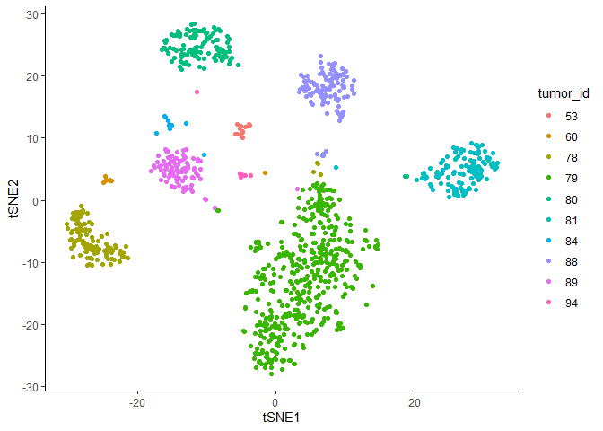
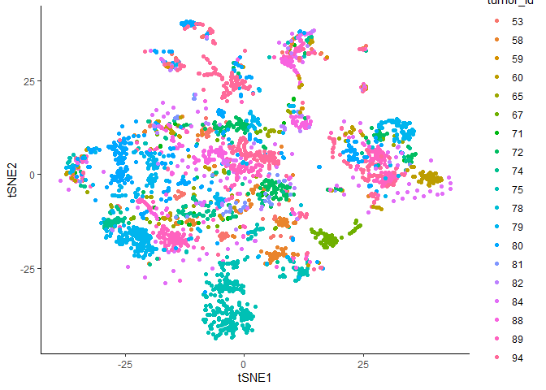
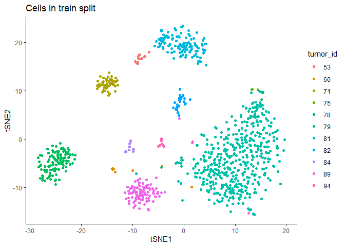
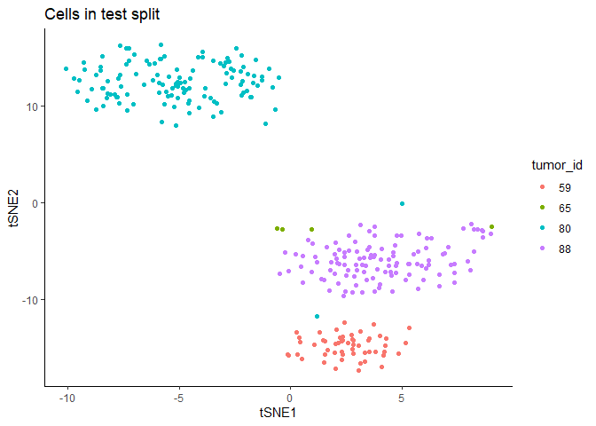
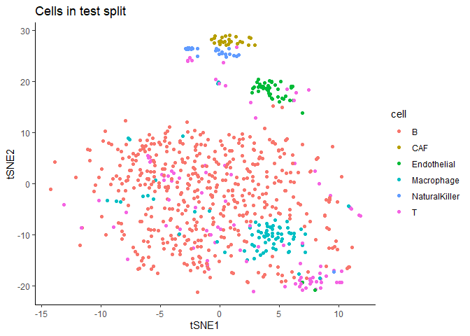
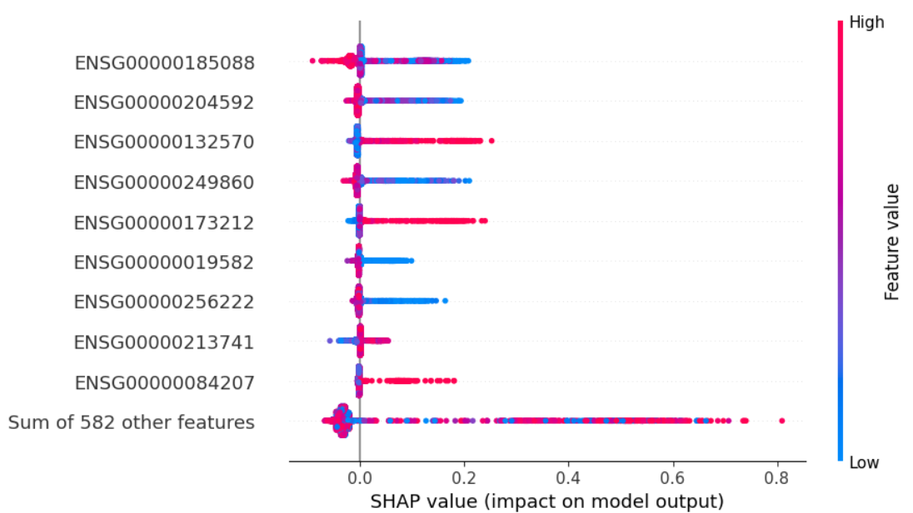

Project report
================
Marco Tello
2024-02-08

# Introduction

The intricate interplay between tumor cells and their microenvironment
is a critical factor influencing cancer development and therapeutic
outcomes, particularly evident in melanoma \[1-5\]. The tumor
microenvironment (TME) constitutes a complex ecosystem with diverse cell
types, encompassing malignant, immune, and stromal cells, as well as
extracellular matrix components \[1,2\]. The challenges posed by this
cellular diversity within the TME are underscored by the variable
clinical efficacy of targeted therapies and immunotherapies in melanoma
\[3\]. While immune checkpoint inhibitors exhibit responses in
metastatic melanomas, the genomic and molecular determinants of these
responses remain elusive \[3,4\]. Additionally, melanomas with the
BRAFV600E mutation, commonly treated with RAF and MEK inhibitors,
eventually develop resistance to these drugs \[4\]. The absence of
targeted therapies for tumors lacking BRAF mutations emphasizes the need
for a comprehensive understanding of melanoma composition and its impact
on clinical outcomes \[4\]. Recent research papers highlight the next
wave of therapeutic advances in cancer, centering on unraveling the
intricacies of the melanoma TME and employing technologies like
single-cell genomic approaches to assess cellular heterogeneity and
inform treatment responses \[3-5\].

The integration of single-cell RNA-sequencing (scRNA-seq) with
supervised learning approaches has emerged as a powerful tool for
unraveling regulatory dynamics and predicting treatment resistance in
skin cancers, like basal cell carcinoma (BCC) \[6\]. In Liu, et al 2021
\[6\], the integration of data analysis and machine learning is employed
to discern the distinctive features of immune responses in BCC, PDAC,
and melanoma. By utilizing supervised learning, the study not only
identifies the molecular determinants associated with non-response to
PD-1 blockade but also constructs a classifier that predicts response on
a cellular level. Strikingly, the classifier achieves near-perfect
accuracy in predicting response to PD-1 blockade in BCC CD8+ T cells.
The incorporation of supervised learning methods facilitated the
prediction of treatment resistance, revealing a distinctive resistance
signature in melanoma that provides valuable insights into resistant sub
populations and uncovers potential therapeutic options.

Recent advancements in machine learning interpretability tools, such as
SHapley Additive exPlanations (SHAP), offer an alternative perspective
for understanding supervised learning models \[7\]. SHAP estimates the
contribution of a given variable to the observed prediction by
approximating its marginal contribution under all possible combinations
with other variables \[7\]. This aids in elucidating complex
interactions within individual predictions, revealing the weight of each
input variable in making predictions. The increasing use of SHAP
analysis for biological datasets underscores its potential for providing
insight into gene regulation dynamics \[8,9\]. In the current project,
the SHAP framework was utilized to identify the genes most relevant in
predicting tumor malignancy, offering a precise interpretation of the
main contributors to model performance. This integrated approach
enhances our understanding of melanoma pathogenesis, treatment
resistance, and the potential for targeted therapeutic interventions.

# Research goal

The current project aims to determine the possibility of translating the
associations between gene expression variability across the tumor
microenvironment and the development of treatment resistance from single
cell RNAseq data to bulk RNAseq samples. For this purpose I re-analyzed
the single cell RNAseq data from Tirosh, et al 2016, composed of the
transcriptomic profiles of 4,646 cells. These cells were further
annotated, based on gene expression markers and copy number variations,
in multiple cell types and malignancy status. They analyzed the single
cell transcriptomic profiles and determined transcriptomic signatures
associated with the development of treatment resistance in an external
bulk RNAseq dataset.

In the current project I propose the use of a supervised learning
framework to learn associations between tumor resistance status (binary
classification) and transcriptomic profiles in the sc-RNAseq dataset.
Then, I evaluated if the associations identified by the supervised
classifier are translated to predict tumor resistance to treatment in
bulk RNAseq samples from patients before and after developing such
resistance. I intend to take advantage of interpretability tools such as
SHAP to determine the genes most relevant in the development of
treatment resistance.

# Methods

### Data availability

The data for the current report was downloaded from the GEO accession
omnibus. sc-RNAseq was accessed under the entry GSE72056, while bulk
RNAseq data was accessed under the entry GSE77940.

### Exploratory data analysis

First, I decided to reproduce the t-SNE plots from the original study to
verify that the data follows the same reported trends

#### Reproduce figure 1C for malignant cells

    ## Performing PCA
    ## Read the 1110 x 50 data matrix successfully!
    ## OpenMP is working. 6 threads.
    ## Using no_dims = 2, perplexity = 30.000000, and theta = 0.500000
    ## Computing input similarities...
    ## Building tree...
    ## Done in 0.05 seconds (sparsity = 0.106832)!
    ## Learning embedding...
    ## Iteration 50: error is 66.525778 (50 iterations in 0.06 seconds)
    ## Iteration 100: error is 58.071896 (50 iterations in 0.05 seconds)
    ## Iteration 150: error is 57.347836 (50 iterations in 0.05 seconds)
    ## Iteration 200: error is 57.160901 (50 iterations in 0.05 seconds)
    ## Iteration 250: error is 57.109195 (50 iterations in 0.05 seconds)
    ## Iteration 300: error is 1.012871 (50 iterations in 0.04 seconds)
    ## Iteration 350: error is 0.854243 (50 iterations in 0.04 seconds)
    ## Iteration 400: error is 0.810279 (50 iterations in 0.04 seconds)
    ## Iteration 450: error is 0.795601 (50 iterations in 0.04 seconds)
    ## Iteration 500: error is 0.785659 (50 iterations in 0.04 seconds)
    ## Iteration 550: error is 0.779652 (50 iterations in 0.04 seconds)
    ## Iteration 600: error is 0.773615 (50 iterations in 0.04 seconds)
    ## Iteration 650: error is 0.767752 (50 iterations in 0.04 seconds)
    ## Iteration 700: error is 0.763319 (50 iterations in 0.04 seconds)
    ## Iteration 750: error is 0.761737 (50 iterations in 0.04 seconds)
    ## Iteration 800: error is 0.760146 (50 iterations in 0.04 seconds)
    ## Iteration 850: error is 0.758860 (50 iterations in 0.04 seconds)
    ## Iteration 900: error is 0.757378 (50 iterations in 0.04 seconds)
    ## Iteration 950: error is 0.755836 (50 iterations in 0.04 seconds)
    ## Iteration 1000: error is 0.754571 (50 iterations in 0.04 seconds)
    ## Fitting performed in 0.85 seconds.

<!-- -->

This plot mostly aligns with what is shown in figure 1c, showing
well-defined clusters by donor for malignant cells. Although sub-setting
to the tumors shown in the figure did not exactly reproduced the plot,
it shows a close resemblance.

#### Reproduce figure 1D for non-malignant cells

    ## Performing PCA
    ## Read the 2629 x 50 data matrix successfully!
    ## OpenMP is working. 6 threads.
    ## Using no_dims = 2, perplexity = 30.000000, and theta = 0.500000
    ## Computing input similarities...
    ## Building tree...
    ## Done in 0.15 seconds (sparsity = 0.049860)!
    ## Learning embedding...
    ## Iteration 50: error is 81.008822 (50 iterations in 0.10 seconds)
    ## Iteration 100: error is 73.863688 (50 iterations in 0.10 seconds)
    ## Iteration 150: error is 73.203492 (50 iterations in 0.10 seconds)
    ## Iteration 200: error is 73.131552 (50 iterations in 0.10 seconds)
    ## Iteration 250: error is 73.128606 (50 iterations in 0.10 seconds)
    ## Iteration 300: error is 1.862896 (50 iterations in 0.09 seconds)
    ## Iteration 350: error is 1.548406 (50 iterations in 0.10 seconds)
    ## Iteration 400: error is 1.415540 (50 iterations in 0.10 seconds)
    ## Iteration 450: error is 1.353825 (50 iterations in 0.10 seconds)
    ## Iteration 500: error is 1.322767 (50 iterations in 0.10 seconds)
    ## Iteration 550: error is 1.302290 (50 iterations in 0.10 seconds)
    ## Iteration 600: error is 1.287808 (50 iterations in 0.10 seconds)
    ## Iteration 650: error is 1.278640 (50 iterations in 0.10 seconds)
    ## Iteration 700: error is 1.271289 (50 iterations in 0.10 seconds)
    ## Iteration 750: error is 1.265581 (50 iterations in 0.10 seconds)
    ## Iteration 800: error is 1.260710 (50 iterations in 0.10 seconds)
    ## Iteration 850: error is 1.256494 (50 iterations in 0.10 seconds)
    ## Iteration 900: error is 1.251920 (50 iterations in 0.10 seconds)
    ## Iteration 950: error is 1.249578 (50 iterations in 0.10 seconds)
    ## Iteration 1000: error is 1.246817 (50 iterations in 0.10 seconds)
    ## Fitting performed in 2.02 seconds.

<!-- --><!-- -->

This plot was more difficult to reproduce and it does not show the clear
separation between T-cells and B-cells. It is likely that they did
perform a different cell subset for the paper. Therefore I tried to use
all cells not labelled as unresolved to make the tSNE plot.

    ## Performing PCA
    ## Read the 3205 x 50 data matrix successfully!
    ## OpenMP is working. 6 threads.
    ## Using no_dims = 2, perplexity = 30.000000, and theta = 0.500000
    ## Computing input similarities...
    ## Building tree...
    ## Done in 0.20 seconds (sparsity = 0.040544)!
    ## Learning embedding...
    ## Iteration 50: error is 83.334562 (50 iterations in 0.12 seconds)
    ## Iteration 100: error is 75.348215 (50 iterations in 0.12 seconds)
    ## Iteration 150: error is 75.050227 (50 iterations in 0.12 seconds)
    ## Iteration 200: error is 75.042739 (50 iterations in 0.12 seconds)
    ## Iteration 250: error is 75.051647 (50 iterations in 0.12 seconds)
    ## Iteration 300: error is 2.022516 (50 iterations in 0.11 seconds)
    ## Iteration 350: error is 1.688200 (50 iterations in 0.12 seconds)
    ## Iteration 400: error is 1.537850 (50 iterations in 0.12 seconds)
    ## Iteration 450: error is 1.454115 (50 iterations in 0.12 seconds)
    ## Iteration 500: error is 1.407819 (50 iterations in 0.12 seconds)
    ## Iteration 550: error is 1.383418 (50 iterations in 0.12 seconds)
    ## Iteration 600: error is 1.367970 (50 iterations in 0.12 seconds)
    ## Iteration 650: error is 1.357221 (50 iterations in 0.12 seconds)
    ## Iteration 700: error is 1.347497 (50 iterations in 0.12 seconds)
    ## Iteration 750: error is 1.339265 (50 iterations in 0.13 seconds)
    ## Iteration 800: error is 1.332904 (50 iterations in 0.12 seconds)
    ## Iteration 850: error is 1.327274 (50 iterations in 0.14 seconds)
    ## Iteration 900: error is 1.323398 (50 iterations in 0.13 seconds)
    ## Iteration 950: error is 1.318979 (50 iterations in 0.13 seconds)
    ## Iteration 1000: error is 1.315907 (50 iterations in 0.13 seconds)
    ## Fitting performed in 2.46 seconds.

<!-- --><!-- -->

Utilizing all cells did not form the separate clusters of T-cells and
B-cells shown in the paper. Given this discrepancy, I next proceeded to
visualize the distribution of the different metadata categories.

#### Distribution of metadata by tumor

Next, I compared the relative and absolute distribution of cells in each
tumor by malignancy status.

<!-- --><!-- -->

In general, it seems like some tumors are composed only of non-malignant
cells such as tumors 58,67,72, and 74. While other tumors primariliy
contain malignant cells, such as 59, 71, 78, 79, and 81. Also it is
noticeable that some tumors represent a higher proportion of the cells
in the complete dataset.

<!-- --><!-- -->

In these visualizations we can observe that the two most predominant
cell types are B-cells and T-cells. Tumors 59, 71, 78, 79, and 81 that
had the highest proportion of malignant cells also contain the highest
proportion of T-cells.

Then, I visualized if there is a relationship between the proportion of
specific cell types and malignancy status. Since this figure 1C did not
show the distribution of cell types across malignant cells.

<!-- -->

This visualization shows that most tumors classified as malignant are
also classified as T-cells, with the exception of tumor 75 whose
malignant cells align more with the B-cell profile.

#### Association with the resistant profile

Lastly, I wanted to visualize the distribution of cell types and
malignancy across the target variable.

<!-- --><!-- --><!-- --><!-- -->

Based on this last visualization, I conclude that including cells from
two resistant tumors in the test split (59, and 65) will provide a
similar distribution of B-cells and T-cells for the positive category.

#### Conclusions EDA

It was not possible to reproduce exactly the plots showed in figure 1C
and 1D from the reference paper, however the general trends of malignant
cell clusters were replicated. In terms of non malignant cells
clustering, T-cells and B-cells did not form independent clusters as
suggested by the manual annotation of figure 1D. This suggest that a
different cell filtering was done prior to dimensionality reduction, or
that a very specific perplexity parameter was selected; however this
information is not provided in the methods description. Next, I
evaluated the distribution of different metadata variables to determine
the expected cell type proportion variability in the dataset. Based on
the exploratory data analysis, selecting tumors 59 and 65 as the
positive target in the test split would constitute a reasonable
representation of cell type variability in resistant tumors. Therefore
the final selection of cells for the test set consists of tumors 59, 65,
74, 80, and 88. This only produces a slight imbalance in the
distribution Natural Killer cells, however is the best division I could
identify. This division sets ~24% of the cells to the test split and the
rest to the training split.

    ## 
    ##  Test Train 
    ##  1111  3534

<!-- --><!-- -->

### Selection of variable genes.

The nest step was to determine what genes could provide the most
informative features for the model. To achieve this, I choose to look at
variability for each gene across cells. I expect this approach will
select the most informative genes across the dataset.

#### Homogenization of gene identifiers

The first step is to load the expression data and homogenize the gene
identifiers between the scRNA-seq and bulk RNA-seq. Specially since the
use of gene names can be ambiguous due to the large amount of synonym
identifies, I prefered to convert all gene identifiers to ENSEMBL Gene
IDs (ENSG). I also used this step to ensure that the set of genes used
for training the model on scRNA-seq data will be available in the bulk
RNA-seq dataset.

#### Gene expression variability visualization

Then, I made the separation between cells in the training and test split
to avoid informing the selection of features from data in the test
split. To gain a more fair variability estimate, I decided to use Median
Absolute Deviation scores (MAD). I utilized MAD scores to measure the
median of the absolute deviations from the median gene expression across
cells. MAD scores have the property of being robust to extreme values
compared to other measures of dispersion, such as the standard
deviation. This property is particularly useful when analyzing sparse
matrices such as scRNA-seq data.

    ##        90th Number genes
    ## 1: 1.067723          592

<!-- -->

The red dotted line represents the 95th percentile of MAD scores, which
conserves 592 genes. To verify that this reduction in the number of
genes conserved the data structure, I recalculated the tSNE plots for
the train and test splits.

    ## Performing PCA
    ## Read the 957 x 50 data matrix successfully!
    ## OpenMP is working. 6 threads.
    ## Using no_dims = 2, perplexity = 30.000000, and theta = 0.500000
    ## Computing input similarities...
    ## Building tree...
    ## Done in 0.05 seconds (sparsity = 0.140715)!
    ## Learning embedding...
    ## Iteration 50: error is 64.601956 (50 iterations in 0.05 seconds)
    ## Iteration 100: error is 60.576145 (50 iterations in 0.04 seconds)
    ## Iteration 150: error is 60.488787 (50 iterations in 0.04 seconds)
    ## Iteration 200: error is 60.479296 (50 iterations in 0.05 seconds)
    ## Iteration 250: error is 60.476265 (50 iterations in 0.05 seconds)
    ## Iteration 300: error is 1.184422 (50 iterations in 0.04 seconds)
    ## Iteration 350: error is 1.084717 (50 iterations in 0.04 seconds)
    ## Iteration 400: error is 1.057392 (50 iterations in 0.04 seconds)
    ## Iteration 450: error is 1.048078 (50 iterations in 0.05 seconds)
    ## Iteration 500: error is 1.043259 (50 iterations in 0.04 seconds)
    ## Iteration 550: error is 1.040570 (50 iterations in 0.04 seconds)
    ## Iteration 600: error is 1.037885 (50 iterations in 0.04 seconds)
    ## Iteration 650: error is 1.035091 (50 iterations in 0.04 seconds)
    ## Iteration 700: error is 1.032257 (50 iterations in 0.04 seconds)
    ## Iteration 750: error is 1.031286 (50 iterations in 0.04 seconds)
    ## Iteration 800: error is 1.030101 (50 iterations in 0.04 seconds)
    ## Iteration 850: error is 1.027940 (50 iterations in 0.04 seconds)
    ## Iteration 900: error is 1.026927 (50 iterations in 0.04 seconds)
    ## Iteration 950: error is 1.025357 (50 iterations in 0.04 seconds)
    ## Iteration 1000: error is 1.024223 (50 iterations in 0.04 seconds)
    ## Fitting performed in 0.81 seconds.

<!-- -->

    ## Performing PCA
    ## Read the 300 x 50 data matrix successfully!
    ## OpenMP is working. 6 threads.
    ## Using no_dims = 2, perplexity = 30.000000, and theta = 0.500000
    ## Computing input similarities...
    ## Building tree...
    ## Done in 0.01 seconds (sparsity = 0.416756)!
    ## Learning embedding...
    ## Iteration 50: error is 52.689828 (50 iterations in 0.02 seconds)
    ## Iteration 100: error is 53.297478 (50 iterations in 0.02 seconds)
    ## Iteration 150: error is 52.282541 (50 iterations in 0.02 seconds)
    ## Iteration 200: error is 53.468260 (50 iterations in 0.02 seconds)
    ## Iteration 250: error is 50.531485 (50 iterations in 0.02 seconds)
    ## Iteration 300: error is 0.869118 (50 iterations in 0.02 seconds)
    ## Iteration 350: error is 0.582987 (50 iterations in 0.02 seconds)
    ## Iteration 400: error is 0.571801 (50 iterations in 0.01 seconds)
    ## Iteration 450: error is 0.567786 (50 iterations in 0.01 seconds)
    ## Iteration 500: error is 0.563997 (50 iterations in 0.01 seconds)
    ## Iteration 550: error is 0.561742 (50 iterations in 0.01 seconds)
    ## Iteration 600: error is 0.559529 (50 iterations in 0.02 seconds)
    ## Iteration 650: error is 0.559188 (50 iterations in 0.02 seconds)
    ## Iteration 700: error is 0.557615 (50 iterations in 0.01 seconds)
    ## Iteration 750: error is 0.555566 (50 iterations in 0.02 seconds)
    ## Iteration 800: error is 0.555160 (50 iterations in 0.02 seconds)
    ## Iteration 850: error is 0.554703 (50 iterations in 0.02 seconds)
    ## Iteration 900: error is 0.554782 (50 iterations in 0.01 seconds)
    ## Iteration 950: error is 0.555078 (50 iterations in 0.01 seconds)
    ## Iteration 1000: error is 0.554836 (50 iterations in 0.01 seconds)
    ## Fitting performed in 0.32 seconds.

<!-- -->

The current data division conserved the well-defined clusters by tumor
IDs for malignant cells.

    ## Performing PCA
    ## Read the 2443 x 50 data matrix successfully!
    ## OpenMP is working. 6 threads.
    ## Using no_dims = 2, perplexity = 30.000000, and theta = 0.500000
    ## Computing input similarities...
    ## Building tree...
    ## Done in 0.19 seconds (sparsity = 0.055903)!
    ## Learning embedding...
    ## Iteration 50: error is 78.824336 (50 iterations in 0.15 seconds)
    ## Iteration 100: error is 78.743179 (50 iterations in 0.20 seconds)
    ## Iteration 150: error is 78.150326 (50 iterations in 0.16 seconds)
    ## Iteration 200: error is 78.144984 (50 iterations in 0.19 seconds)
    ## Iteration 250: error is 78.140857 (50 iterations in 0.18 seconds)
    ## Iteration 300: error is 2.413786 (50 iterations in 0.11 seconds)
    ## Iteration 350: error is 2.223631 (50 iterations in 0.12 seconds)
    ## Iteration 400: error is 2.146876 (50 iterations in 0.11 seconds)
    ## Iteration 450: error is 2.107702 (50 iterations in 0.13 seconds)
    ## Iteration 500: error is 2.086157 (50 iterations in 0.12 seconds)
    ## Iteration 550: error is 2.074921 (50 iterations in 0.11 seconds)
    ## Iteration 600: error is 2.067276 (50 iterations in 0.11 seconds)
    ## Iteration 650: error is 2.061398 (50 iterations in 0.10 seconds)
    ## Iteration 700: error is 2.056222 (50 iterations in 0.10 seconds)
    ## Iteration 750: error is 2.052358 (50 iterations in 0.10 seconds)
    ## Iteration 800: error is 2.049372 (50 iterations in 0.10 seconds)
    ## Iteration 850: error is 2.045314 (50 iterations in 0.12 seconds)
    ## Iteration 900: error is 2.042851 (50 iterations in 0.12 seconds)
    ## Iteration 950: error is 2.040595 (50 iterations in 0.12 seconds)
    ## Iteration 1000: error is 2.038075 (50 iterations in 0.11 seconds)
    ## Fitting performed in 2.58 seconds.

<!-- -->

    ## Performing PCA
    ## Read the 762 x 50 data matrix successfully!
    ## OpenMP is working. 6 threads.
    ## Using no_dims = 2, perplexity = 30.000000, and theta = 0.500000
    ## Computing input similarities...
    ## Building tree...
    ## Done in 0.04 seconds (sparsity = 0.180283)!
    ## Learning embedding...
    ## Iteration 50: error is 64.619588 (50 iterations in 0.05 seconds)
    ## Iteration 100: error is 63.372002 (50 iterations in 0.05 seconds)
    ## Iteration 150: error is 63.376488 (50 iterations in 0.04 seconds)
    ## Iteration 200: error is 63.375774 (50 iterations in 0.04 seconds)
    ## Iteration 250: error is 63.380683 (50 iterations in 0.04 seconds)
    ## Iteration 300: error is 1.501511 (50 iterations in 0.04 seconds)
    ## Iteration 350: error is 1.410108 (50 iterations in 0.03 seconds)
    ## Iteration 400: error is 1.383780 (50 iterations in 0.03 seconds)
    ## Iteration 450: error is 1.374695 (50 iterations in 0.05 seconds)
    ## Iteration 500: error is 1.367260 (50 iterations in 0.03 seconds)
    ## Iteration 550: error is 1.363560 (50 iterations in 0.03 seconds)
    ## Iteration 600: error is 1.359854 (50 iterations in 0.04 seconds)
    ## Iteration 650: error is 1.357553 (50 iterations in 0.03 seconds)
    ## Iteration 700: error is 1.354344 (50 iterations in 0.03 seconds)
    ## Iteration 750: error is 1.353572 (50 iterations in 0.03 seconds)
    ## Iteration 800: error is 1.353157 (50 iterations in 0.03 seconds)
    ## Iteration 850: error is 1.352414 (50 iterations in 0.03 seconds)
    ## Iteration 900: error is 1.351519 (50 iterations in 0.03 seconds)
    ## Iteration 950: error is 1.350742 (50 iterations in 0.03 seconds)
    ## Iteration 1000: error is 1.350223 (50 iterations in 0.03 seconds)
    ## Fitting performed in 0.72 seconds.

<!-- -->

Although the non-malignant cells did not provide a clear cell-type
clustering as with the cull set of genes, most cells types were mapped
to a similar region.

### Standardization of gene expression values

The final step for the creation of expression variables is to ensure a
correct representation of gene expression values across cells. I opted
to transform gene expression values to z-scores within cell types so the
expression values are consistent for the same cell.

Conserving the top 5% variable genes provided a reasonable baseline to
cluster individual cells by cell type and tumor, while reducing the
number of expression variables to 527 from ~ 9,000. Therefore, the final
feature table will conserve most of the variability across cell-types.

### Supervised learning pipeline

Once the feature tables were designed, I proceeded to train an XGBoost
classifier with the expression profiles to predict if the cell belongs
to a tumor that developed resistance or not. For more details of the
supervised learning code, please refer to the jupyter notebook
“SupervisedPipeline.ipynb” located under the “JupyterNB” folder.

### Baseline performance

First, I calculated the performance of the XGBoost model and a
DummyClassifier with the default hyper-parameters. For the CV strategy,
I utilized a 5-fold stratified division to conserve the proportion of
positive and negative instances across CV folds. As performance metrics
I utilized F1 score, AUROC, and AUPR. The average performance in the
test split during the CV are as follows:

<table>
<thead>
<tr>
<th style="text-align:left;">
Classifier
</th>
<th style="text-align:right;">
F1
</th>
<th style="text-align:right;">
AUROC
</th>
<th style="text-align:right;">
AUPR
</th>
</tr>
</thead>
<tbody>
<tr>
<td style="text-align:left;">
Dummy
</td>
<td style="text-align:right;">
0.000
</td>
<td style="text-align:right;">
0.50
</td>
<td style="text-align:right;">
0.12
</td>
</tr>
<tr>
<td style="text-align:left;">
XGBoost
</td>
<td style="text-align:right;">
0.898
</td>
<td style="text-align:right;">
0.99
</td>
<td style="text-align:right;">
0.97
</td>
</tr>
</tbody>
</table>

### Hyper-parameter tuning

Then, I performed a random search of the hyper-parameter space for the
XGBoost model optimizing the AUPR metric due to the imbalanced nature of
the dataset. I started with only one hyper-parameter and then I
gradually increased the number of hyper-parameters included in the
following order. The number between parenthesis indicates the final
range of values used for the search, and the rightmost number indicates
the value for the best model:

1.  `n_estimators` (200-250): 180

2.  `max_delta_step` (5-9): 8

3.  `max_depth` (8-12): 10

4.  `learning_rate` (0.1 - 1): 0.16

5.  `reg_alpha` (0.01 - 10): 0.01

# Results

## XGBoost model accurately predicts tumor resistance in sc-RNA seq data

The performance of the XGBoost model in the held-out cells achieved a
good classification performance as indicated in the following table.

<table>
<thead>
<tr>
<th style="text-align:left;">
Classifier
</th>
<th style="text-align:right;">
F1
</th>
<th style="text-align:left;">
F1_sd
</th>
<th style="text-align:right;">
AUROC
</th>
<th style="text-align:left;">
AUROC_sd
</th>
<th style="text-align:right;">
AUPR
</th>
<th style="text-align:left;">
AUPR_sd
</th>
</tr>
</thead>
<tbody>
<tr>
<td style="text-align:left;">
Dummy
</td>
<td style="text-align:right;">
0.00
</td>
<td style="text-align:left;">
± 0
</td>
<td style="text-align:right;">
0.50
</td>
<td style="text-align:left;">
± 0
</td>
<td style="text-align:right;">
0.12
</td>
<td style="text-align:left;">
± 0.002
</td>
</tr>
<tr>
<td style="text-align:left;">
XGBoost
</td>
<td style="text-align:right;">
0.74
</td>
<td style="text-align:left;">
± 0.23
</td>
<td style="text-align:right;">
0.98
</td>
<td style="text-align:left;">
± 0.025
</td>
<td style="text-align:right;">
0.91
</td>
<td style="text-align:left;">
± 0.1
</td>
</tr>
</tbody>
</table>

The fact that the model has high AUROC and AUPR scores suggests that it
is effective in handling the class imbalance; successfully identifying
positive instances without compromising too much on precision. In
addition, it is important to consider the variability indicated by the
standard deviations (XGBoost_sd) associated with these metrics. An F1
score of 0.74 also indicates a relatively good balance between precision
and recall, suggesting the model is performing well in terms of both
identifying positive instances and avoiding false positives. The
standard deviations provide a measure of the variability or uncertainty
in the metric estimates. In this case, the relatively small standard
deviations suggest that model performance is stable across different
folds or iterations of the evaluation process.

## Model trained on sc-RNAseq were not able to predict tumor resistance in bulk data

The main objective of the developed model was to translate the
association patterns between sc-RNAseq profiles and the development of
treatment resistance. To evaluate this property, I utilized the XGBoost
model trained on sc-RNAseq data to predict tumor resistance in paired
bulk RNAseq samples before and after the cancer became resistant to
treatment. The model predicted all samples as non-resistant with a high
probability:

<table>
<thead>
<tr>
<th style="text-align:right;">
DonorID
</th>
<th style="text-align:left;">
TrueResistant
</th>
<th style="text-align:right;">
P(Resistant)
</th>
<th style="text-align:right;">
1-P(Resistant)
</th>
</tr>
</thead>
<tbody>
<tr>
<td style="text-align:right;">
1
</td>
<td style="text-align:left;">
No
</td>
<td style="text-align:right;">
0.0140
</td>
<td style="text-align:right;">
0.985
</td>
</tr>
<tr>
<td style="text-align:right;">
1
</td>
<td style="text-align:left;">
Yes
</td>
<td style="text-align:right;">
0.0070
</td>
<td style="text-align:right;">
0.993
</td>
</tr>
<tr>
<td style="text-align:right;">
2
</td>
<td style="text-align:left;">
No
</td>
<td style="text-align:right;">
0.0004
</td>
<td style="text-align:right;">
0.999
</td>
</tr>
<tr>
<td style="text-align:right;">
2
</td>
<td style="text-align:left;">
Yes
</td>
<td style="text-align:right;">
0.0003
</td>
<td style="text-align:right;">
0.999
</td>
</tr>
<tr>
<td style="text-align:right;">
3
</td>
<td style="text-align:left;">
No
</td>
<td style="text-align:right;">
0.0820
</td>
<td style="text-align:right;">
0.918
</td>
</tr>
<tr>
<td style="text-align:right;">
3
</td>
<td style="text-align:left;">
Yes
</td>
<td style="text-align:right;">
0.0340
</td>
<td style="text-align:right;">
0.966
</td>
</tr>
<tr>
<td style="text-align:right;">
4
</td>
<td style="text-align:left;">
No
</td>
<td style="text-align:right;">
0.0020
</td>
<td style="text-align:right;">
0.998
</td>
</tr>
<tr>
<td style="text-align:right;">
4
</td>
<td style="text-align:left;">
No
</td>
<td style="text-align:right;">
0.0230
</td>
<td style="text-align:right;">
0.979
</td>
</tr>
<tr>
<td style="text-align:right;">
5
</td>
<td style="text-align:left;">
No
</td>
<td style="text-align:right;">
0.0170
</td>
<td style="text-align:right;">
0.983
</td>
</tr>
<tr>
<td style="text-align:right;">
5
</td>
<td style="text-align:left;">
Yes
</td>
<td style="text-align:right;">
0.0140
</td>
<td style="text-align:right;">
0.985
</td>
</tr>
</tbody>
</table>

The discrepancy with the results from the presentation are likely due to
a more strict division of tumor samples and gene expression
standardization.

## Qualitative evaluation of sc-RNAseq model

Due to the limited ability of the model trained in sc-RNAseq data to
predict tumor resistance in bulk RNAseq data, I proceeded to perform a
qualitative evaluation of the model in the full single cell dataset. The
general visualization of SHAP values indicates a clear association for
the following genes:

The gene with higher absolute contribution to the model was the
ribosomal protein ENSG00000185088 (RPS27L), followed by ENSG00000204592
(HLA-E). A recent study by Bakr et al 2020, highlights the crucial role
of other ribosomal proteins such as RPS19 and RPS3 as biomarkers of
melanoma prognosis \[10\]. On the other hand, HLA-E plays an important
inmunological role and according to the Human Protein Atlas, it is
upregulated in leukemia samples and it is associated with an unfavorable
prognosis in renal cancer. It is interesting that many genes showed a
clear bimodal association of SHAP with expression values such as the
ribosomal protein RPS29 (ENSG00000213741), indicating a potential role
as tumor resistance biomarker.

# Discussion

The current supervised pipeline presented a high ability to predict
tumor resistance in single cell RNAseq data, however it was not able to
detect transcriptomic differences in bulk RNAseq samples during the
development of treatment resistance. The main differences with the
results presented lay in the independent standardization of cells from
the test and training splits and in the change of the standardization
method to use MAD scores instead of standard deviation. These changes
were conserved to prevent data leakage from test into train and to keep
a consistent metric of variability that reduces the impact from
outliers. The previous model and results are available in the folder
JupyterNB with the suffix “prev_iter” for future comparisons. Despite
the reduced ability to predict resistance in the bulk samples, the
current supervised pipeline still provided a similar performance in the
single cell data. The interpretation of the single cell model provided
clear insights from genes with a potential association with tumor
resistance development, however it did not provide very clear biological
interpretations as in the previous model iteration.

Also, as part of the analysis of the dataset, I developed a ShinyApp
template to perform exploratory data analysis in an interactive way that
can be accessed [here](https://mtello.shinyapps.io/reactive_doc/), and a
version with pre-calculated tSNE coordinates is available
[here](https://mtello.shinyapps.io/tsneviz/). Due to file size and
computational resources limitations, only a small demo is available
online, however developing this app provided me with the additional
experience to build accesible tools for analysis of single cell RNAseq
data.

# References

1.  Arneth, B. (2019). Tumor microenvironment. *Medicina*, *56*(1), 15.

2.  Meacham, C. E., & Morrison, S. J. (2013). Tumour heterogeneity and
    cancer cell plasticity. *Nature*, *501*(7467), 328-337.

3.  Wu, T., & Dai, Y. (2017). Tumor microenvironment and therapeutic
    response. *Cancer letters*, *387*, 61-68.

4.  Tirosh, I., Izar, B., Prakadan, S. M., Wadsworth, M. H., Treacy, D.,
    Trombetta, J. J., ... & Garraway, L. A. (2016). Dissecting the
    multicellular ecosystem of metastatic melanoma by single-cell
    RNA-seq. *Science*, *352*(6282), 189-196.

5.  Li, L., Xiong, F., Wang, Y., Zhang, S., Gong, Z., Li, X., & Guo, C.
    (2021). What are the applications of single-cell RNA sequencing in
    cancer research: a systematic review. *Journal of Experimental &
    Clinical Cancer Research*, *40*(1), 1-12.

6.  Liu, R., Dollinger, E., & Nie, Q. (2022). Machine Learning of Single
    Cell Transcriptomic Data From anti-PD-1 Responders and
    Non-responders Reveals Distinct Resistance Mechanisms in Skin
    Cancers and PDAC. *Frontiers in Genetics*, *12*, 806457.

7.  Lundberg, S. M., & Lee, S. I. (2017). A unified approach to
    interpreting model predictions. *Advances in neural information
    processing systems*, *30*.

8.  Huang, F., Chen, L., Guo, W., Huang, T., & Cai, Y. D. (2022).
    Identification of human cell cycle phase markers based on
    single-cell RNA-seq data by using machine learning methods. *BioMed
    Research International*, *2022*.

9.  Yap, M., Johnston, R. L., Foley, H., MacDonald, S., Kondrashova, O.,
    Tran, K. A., ... & Waddell, N. (2021). Verifying explainability of a
    deep learning tissue classifier trained on RNA-seq data. *Scientific
    reports*, *11*(1), 2641.

10. Bakr, M. N., Takahashi, H., & Kikuchi, Y. (2022). Analysis of
    melanoma gene expression signatures at the single-cell level
    uncovers 45-gene signature related to prognosis. *Biomedicines*,
    *10*(7), 1478.
